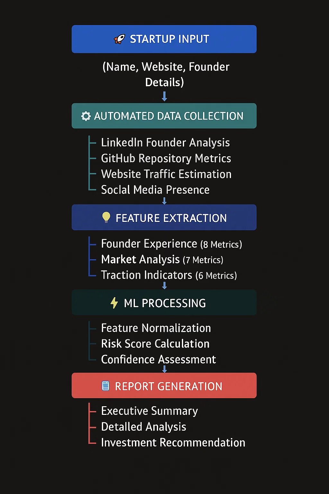
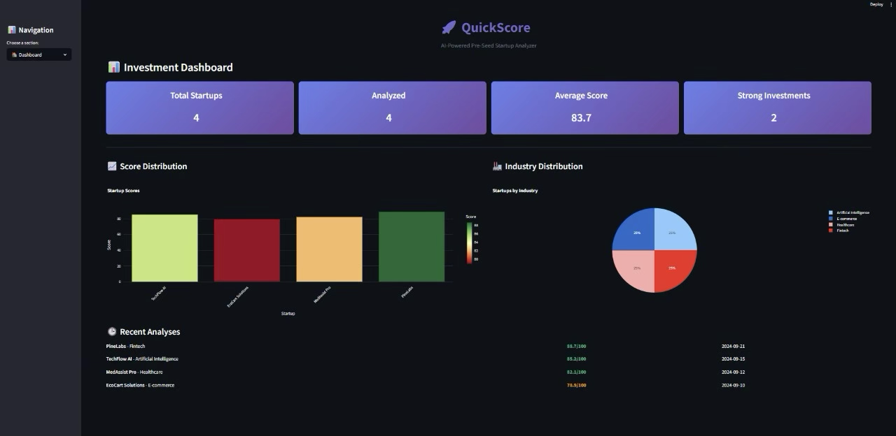

# QuickScore - Pre-Seed Startup Analyzer MVP

A comprehensive AI-powered platform for analyzing pre-seed startups, extracting insights from pitch decks, and providing investment recommendations.

<p align="center">
  
</p>

<p align="center"><em>Flow Diagram</em></p>

<p align="center">
  
</p>


<p align="center"><em>Streamlit Dashboard</em></p>

<p align="center">
  
</p>

<p align="center"><em>QuickScore Dashboard</em></p>

## Features

- **Document Processing**: Extract and analyze pitch decks, financial documents
- **AI-Powered Evaluation**: OpenAI-based scoring across 5 key dimensions
- **Web Scraping**: Intelligent data collection from LinkedIn, websites, GitHub
- **ML Analytics**: Feature engineering and predictive modeling
- **Batch Processing**: Analyze multiple startups simultaneously
- **Investment Reports**: Generate professional analysis reports

## Quick Start

### Prerequisites

- Python 3.11+
- PostgreSQL 15+
- Redis 7+
- Node.js 18+ (for frontend)

### Installation

1. **Clone and setup backend**:
```bash
git clone <your-repo-url>
cd quickscore

# Create virtual environment
python -m venv venv
venv\Scripts\activate  # Windows
# source venv/bin/activate  # Linux/Mac

# Install dependencies
pip install -r requirements.txt
playwright install
```

2. **Setup database**:
```bash
# Start PostgreSQL and Redis (using Docker)
docker-compose up -d postgres redis

# Run migrations
alembic upgrade head
```

3. **Configure environment**:
```bash
cp .env.example .env
# Edit .env with your API keys and database URLs
```

4. **Start development servers**:
```bash
# Backend API
uvicorn app.main:app --reload --port 8000

# Celery worker (new terminal)
celery -A app.worker worker --loglevel=info

# Celery beat scheduler (new terminal)  
celery -A app.worker beat --loglevel=info
```

## API Usage

### Create Startup
```bash
curl -X POST "http://localhost:8000/api/v1/startups" \
  -H "Content-Type: application/json" \
  -d '{
    "name": "TechCorp",
    "website": "https://techcorp.com",
    "industry": "SaaS",
    "description": "AI-powered project management tool"
  }'
```

### Trigger Analysis
```bash
curl -X POST "http://localhost:8000/api/v1/startups/{startup_id}/analyze" \
  -F "pitch_deck=@pitch_deck.pdf" \
  -F "founder_linkedin=https://linkedin.com/in/founder"
```

### Get Results
```bash
curl "http://localhost:8000/api/v1/analyses/{analysis_id}"
```

## Architecture

- **FastAPI**: REST API with async support
- **SQLAlchemy**: Database ORM with Alembic migrations
- **Celery**: Background task processing
- **OpenAI**: LLM-powered evaluation
- **Playwright**: Web scraping with anti-detection
- **scikit-learn**: Feature engineering and ML models

## Scoring Framework

The system evaluates startups across 5 dimensions:

1. **Team (40%)**: Founder experience, domain expertise, track record
2. **Market (25%)**: TAM, timing, competition, growth potential  
3. **Product (15%)**: Differentiation, technical feasibility, UX
4. **Traction (10%)**: Early metrics, user feedback, partnerships
5. **Pitch Quality (10%)**: Clarity, storytelling, presentation

## Deployment

### Production with Docker
```bash
docker-compose up --build
```

### Deploy to Railway
```bash
railway login
railway up
```

## Testing

```bash
# Run all tests
pytest

# Run with coverage
pytest --cov=app tests/

# Run specific test categories
pytest tests/unit/
pytest tests/integration/
```

## Development

### Code Quality
```bash
# Format code
black app/ tests/
isort app/ tests/

# Lint
flake8 app/ tests/
```

### Database Migrations
```bash
# Create migration
alembic revision --autogenerate -m "Add new feature"

# Apply migrations
alembic upgrade head
```

## License

MIT License - see LICENSE file for details.

## Contributing

1. Fork the repository
2. Create a feature branch
3. Make your changes
4. Add tests
5. Submit a pull request

## Contributers

Mehardeep Singh Sandhu

[GitHub](https://github.com/Mehardeep79)

